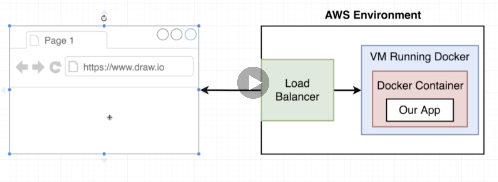
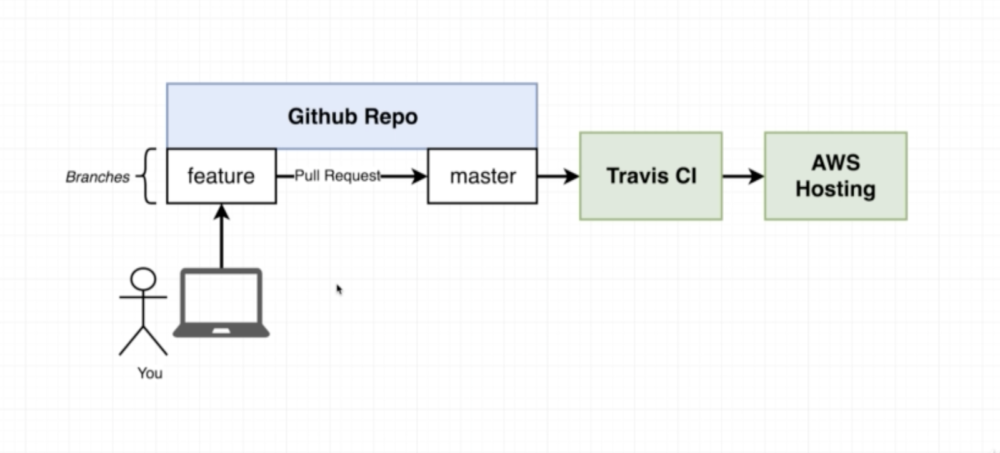

# Using Travis-CI
[DockerReact-env.eba-9npzcn7n.us-east-2.elasticbeanstalk.com](http://dockerreact-env.eba-9npzcn7n.us-east-2.elasticbeanstalk.com/)

## Git Hub
git init
git add .
git commit -m "initial commit"
 git remote add origin https://github.com/JayneJacobs/docker-react.git
PASML-335382:frontend jjacob151$ git push -u origin master


https://facebook.github.io/create-react-app/docs/running-tests#linux-macos-bash

and enviornment variables in Docker here:

https://docs.docker.com/engine/reference/run/#env-environment-variables

# Tell[ Travis how to run](.travis.yml)
```yaml
script:
  - docker run -e CI=true jaynejacobs/docker-react npm run test
  ```
https://travis-ci.org/github/JayneJacobs/docker-react/jobs/******


### Elastic Bean Stalk

Create application


### S3 bucket name
https://s3.console.aws.amazon.com/s3/buckets/********/?region=********

### IAM

https://console.aws.amazon.com/iam/home?region=us-east-2#/home

Attach existing policies directly -AWSElasticBeanstalkFullAccess

Store keys directly in travis-ci


Expose 80 in Dockerfile

https://docs.docker.com/develop/develop-images/multistage-build/#name-your-build-stages

## CI Workflow



git checkout -b feature

Update

git push origin feature

